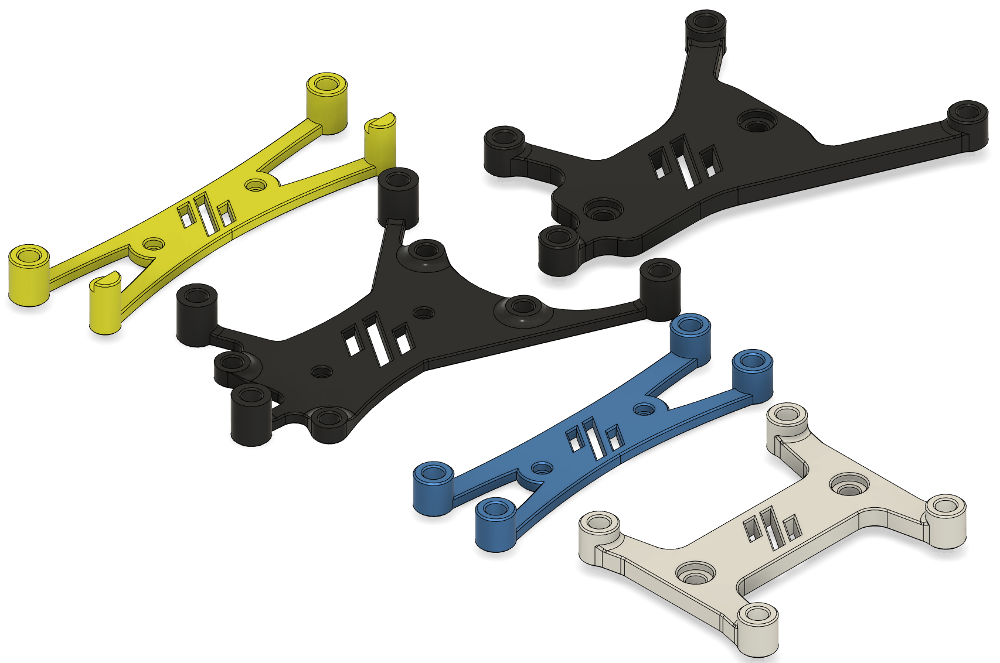

# Voron_DIN_Mounts
Various DIN rail mounts for Voron components.

# BOM

- M3x5x4 heatset inserts (standard Voron heatset inserts)
- M3x6 button head screws
- Self-tapping M2x10 screws for Trident/v2.4r2 PCB DIN clip mounts
- <a href="https://github.com/VoronDesign/Voron-Trident/blob/main/STLs/ElectronicsBay/pcb_din_clip_v2_x5.stl"> Voron PCB DIN clip</a>
- SSR DIN Rail mount (can be found at various Voron vendor sites)

# BTT SKR Mini E3 DIN Mount

Modified standard SKR Mini E3 from Voron V0 repo (https://github.com/VoronDesign/Voron-0) to use PCB DIN clips from the current Trident and v2.4r2 releases. 

# BTT SKR Mini E3 SSR DIN Mount

Modified SKR Mini E3 mount from V0 to use with a SSR DIN mount. I recommend this mount instead of the regular DIN rail mount if you are mounting the MCU on a vertical DIN rail.

# Mellow Fly-UTOC DIN Mount

Based on timmit99's Klipper_Expander board. Uses Trident/v2.4 PCB DIN rail clip.

# Klipper_Expander Mount

Based on timmit99's original Klipper_Expander mount located at: https://github.com/VoronDesign/Voron-Hardware/tree/master/Klipper_Expander. Changes include mounting holes to fit PCB DIN clips from the current Trident and v2.4r2 releases. Also has been modified to use standard voron M3x5x4 heatset inserts.

# Raspberry Pi DIN SSR Moount

Adapted from https://www.thingiverse.com/thing:5222787. Recommended if mounting the RPi on a vertical DIN rail.
